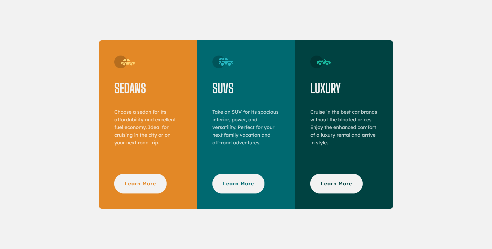

# 3 Column Preview Card


## Links
- [Challenge Link](https://www.frontendmentor.io/challenges/3column-preview-card-component-pH92eAR2-)
- [Site Preview](https://robinjmm-column-preview.netlify.app/)

## About
This is my solution for the challenge of building a 3-column preview card component from [Frontendmentor.io](https://frontendmentor.io).

The goal is to re-create the layout of three card components. The cards would all stack on top of one another on mobile views, then turn into a 3-column layout on larger screens. There is also an element of interactivity when hovering over the buttons in the card.

**Any feedback on how to improve my solution would be greatly appreciated**. 😊

## User Stories
The user should be able to:
- View the optimal layout depending on their device's screen size.
- See the hover states for interactive elements.

## Built With
- Semantic HTML5
- CSS3
- Flexbox
- Sass

## Usage
You can download the project files by clicking on the green **Code** button, then select **Download Zip**.

Once you finish extracting, move into the project folder, open the terminal, and type the following code:

```
npm install
```

This will install all the required dependencies.

To compile Sass into CSS and watch for any future changes, type the following code in your terminal:


```
npm run sass
```

To compile Sass into a minified version of CSS, run:

```
npm run prod
```

## Acknowledgement
I'm very grateful to the people at [Frontendmentor.io](https://frontendmentor.io) for providing designs and challenges that help me improve my skills as a web developer.